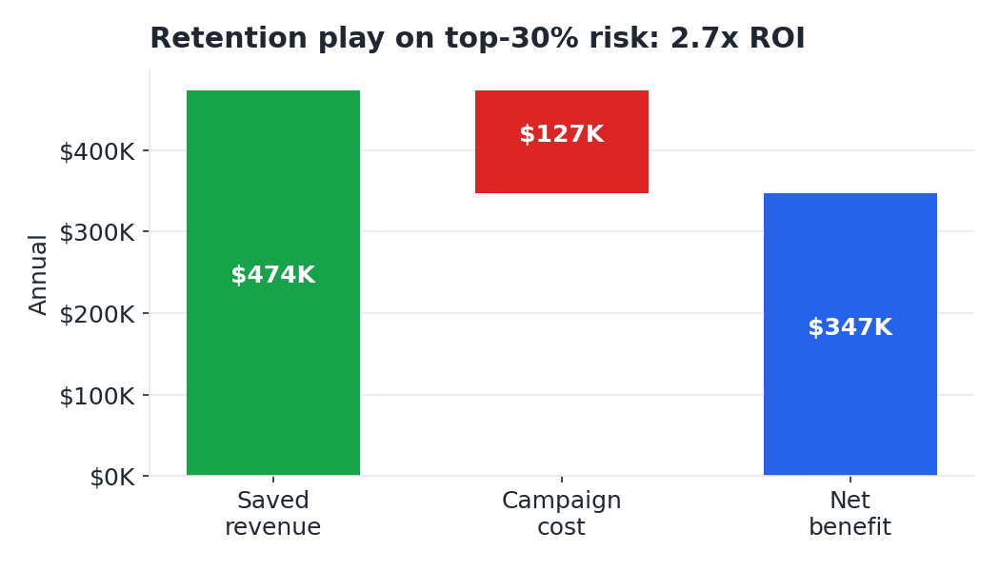

# Reducing Customer Churn — A Retention Business Case

**Business question:** A telecom carrier loses about a quarter of its customers a
year. *Who is most likely to leave, why, and is it worth paying to keep them?*

## Recommendation (the bottom line)

Churn is **26.5%** — roughly **$1.67M** of annual recurring revenue, and the
customers leaving pay *more* than the ones who stay. It's also predictable: a
churn model (test **AUC 0.85**) concentrates **67% of all churn into the top 30%
of customers by risk**. Targeting that group with a retention offer nets an
estimated **~$347K per year at 2.7x ROI** — positive even under conservative
assumptions.

Four moves: (1) aim retention at the top-30% risk, (2) convert high-risk
month-to-month customers to annual contracts, (3) fix the first six months with
onboarding and bundled tech-support/security, (4) shift electronic-check payers
to autopay.



## Deliverables

| File | What it is |
|---|---|
| **[`Churn_Executive_Brief.pdf`](Churn_Executive_Brief.pdf)** | One-page executive brief — the "read nothing else" summary |
| **[`Churn_Retention_Readout.pptx`](Churn_Retention_Readout.pptx)** | 7-slide stakeholder readout deck |
| **[`churn_analysis.ipynb`](churn_analysis.ipynb)** | The full analysis: EDA, churn drivers, model, and ROI |

## How the analysis works

1. **Frame the money.** Churn rate × monthly charges → ~$1.67M annual revenue at risk.
2. **Find the drivers.** Churn by contract, tenure, internet type, payment method, and add-ons.
3. **Predict churn.** A logistic-regression model scores every customer; risk deciles show the lift.
4. **Quantify the play.** Target the top-30% risk with a retention offer; model net benefit and ROI, with a sensitivity check.

## Reproduce it

```bash
pip install -r requirements.txt
python make_figures.py                                   # regenerate charts
jupyter nbconvert --to notebook --execute churn_analysis.ipynb   # rerun the analysis
node build_deck.js                                       # rebuild the deck (needs pptxgenjs)
```

## Data

**IBM Telco Customer Churn** — a public dataset of 7,043 customers
([Kaggle](https://www.kaggle.com/datasets/blastchar/telco-customer-churn)):
tenure, contract, charges, services, and whether each customer churned. Dollar
figures assume the listed monthly charges are recurring revenue.

## Caveats & next steps

The retention save-rate is a stated assumption — it should be validated with a
small **A/B holdout** before scaling. Adding customer-service and usage data
would sharpen the model, and the elevated churn among fiber-optic customers
(even after controlling for price) is worth a separate service-quality look.
