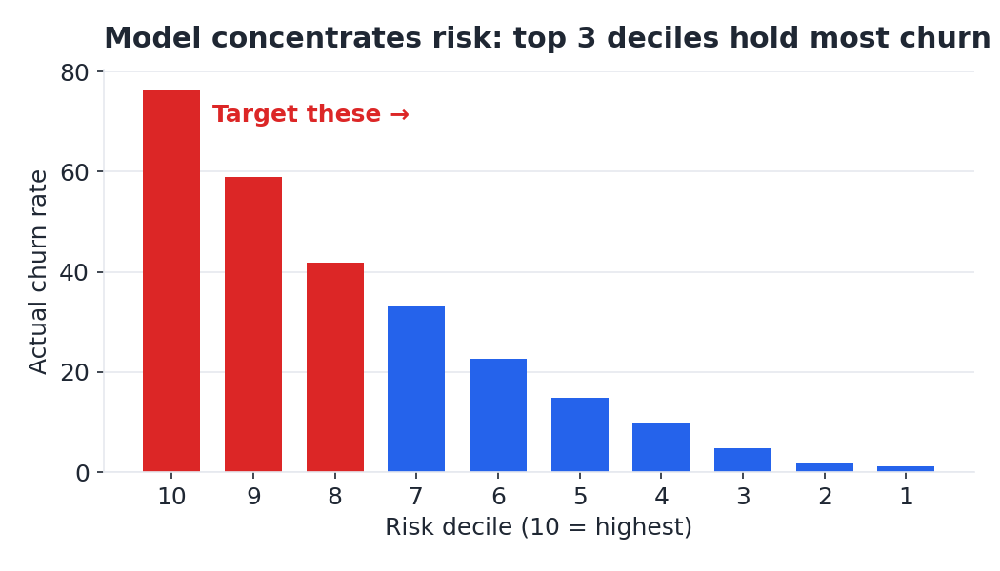

# Customer Churn & Retention Business Case

A business-focused analytics project that moves from **exploratory analysis → predictive modeling → financial recommendation** using the IBM Telco Customer Churn dataset.

**Business question:** A telecom carrier loses about a quarter of its customers a year. *Who is most likely to leave, why, and is it worth paying to keep them?*

## Executive takeaway

Churn is **26.5%** — roughly **$1.67M of annual recurring revenue at risk** — and the customers leaving pay more on average than the customers who stay.

A logistic-regression model reaches **0.85 test AUC** and concentrates **67% of observed churn into the highest-risk 30% of customers**. Under the stated retention assumptions, targeting that group produces an estimated **~$347K annual net benefit at 2.7x ROI**.

Recommended actions:

1. Focus retention efforts on the top-30% predicted-risk segment.
2. Move high-risk month-to-month customers toward annual contracts.
3. Strengthen the first six months of the customer lifecycle with onboarding and bundled support/security.
4. Encourage electronic-check customers to move to autopay.

## Key visuals

| Risk concentration | Retention economics |
|---|---|
|  |  |

The model is useful because it does more than rank customers: it creates a practical target population small enough for a retention program while capturing most observed churn.

## What this project demonstrates

- **Business framing:** translates churn into revenue exposure rather than treating it only as a classification problem.
- **Predictive analytics:** logistic regression, train/test evaluation, ROC-AUC, and risk segmentation.
- **Decision support:** converts model output into an actionable targeting strategy.
- **Financial analysis:** estimates offer cost, retained revenue, net benefit, and ROI.
- **Communication:** includes a one-page executive brief and stakeholder presentation in addition to the technical notebook.
- **Analytical judgment:** explicitly separates measured results from assumptions that still require experimentation.

## Deliverables

| File | What it is |
|---|---|
| **[`Churn_Executive_Brief.pdf`](Churn_Executive_Brief.pdf)** | One-page executive brief — the “read nothing else” summary |
| **[`Churn_Retention_Readout.pptx`](Churn_Retention_Readout.pptx)** | Seven-slide stakeholder readout deck |
| **[`churn_analysis.ipynb`](churn_analysis.ipynb)** | Full analysis: EDA, churn drivers, model, risk segmentation, and ROI |

## Analysis workflow

1. **Frame the money.** Translate churn rate and recurring charges into annual revenue exposure.
2. **Find the drivers.** Examine churn by contract, tenure, internet type, payment method, and add-ons.
3. **Predict churn.** Train a logistic-regression model and evaluate out-of-sample discrimination.
4. **Prioritize customers.** Rank predicted risk and measure how much observed churn falls into the highest-risk segments.
5. **Quantify the play.** Model the economics of a targeted retention offer and test sensitivity to key assumptions.
6. **Communicate the recommendation.** Package the analysis into executive and stakeholder-ready outputs.

## Reproduce the analysis

```bash
pip install -r requirements.txt
python make_figures.py
jupyter nbconvert --to notebook --execute churn_analysis.ipynb
node build_deck.js  # requires pptxgenjs
```

## Data

**IBM Telco Customer Churn** — a public dataset of 7,043 customers from Kaggle. It includes tenure, contract type, monthly charges, subscribed services, payment method, and whether each customer churned.

Dollar figures in this project treat listed monthly charges as recurring revenue for business-case modeling.

## Caveats & next steps

The retention save-rate is an explicit assumption, not an observed causal effect. Before scaling the program, the offer should be validated with a randomized **A/B holdout**.

Additional customer-service, product-usage, complaint, and network-quality data could improve the model and help determine whether elevated churn among fiber-optic customers reflects price, service quality, or another underlying factor.
